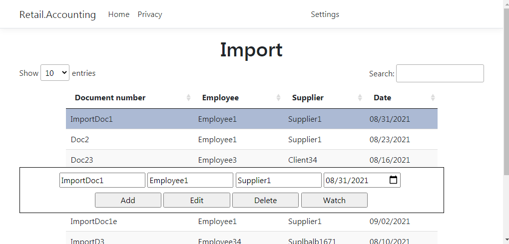
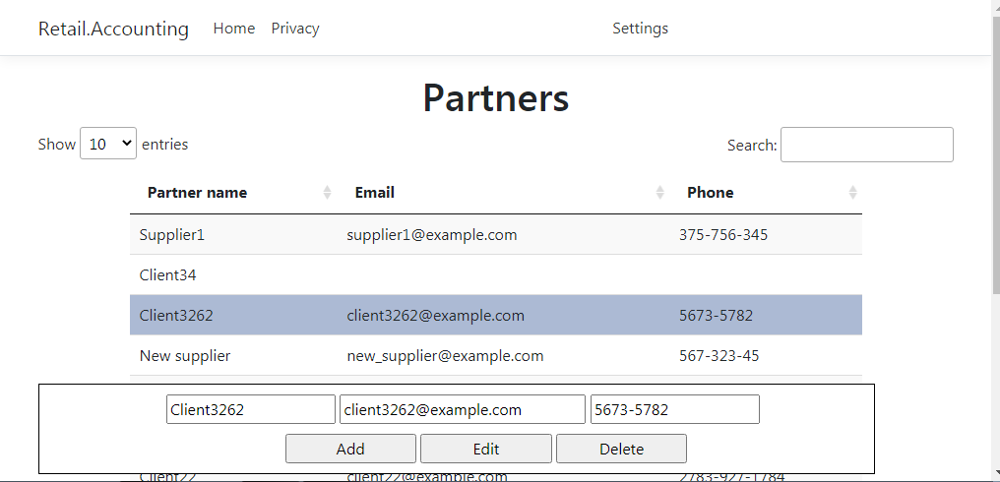
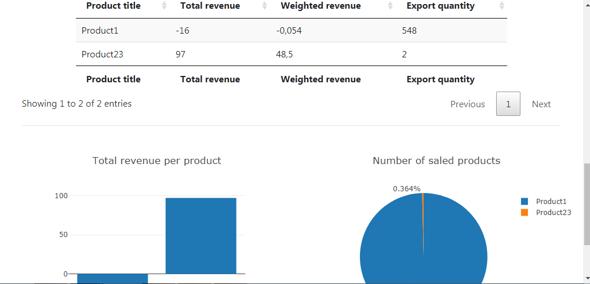

# Retail-Accounting-WebApp

`Retail-Accounting-WebApp` is written in **C#** using **ASP.NET Core**. 

You can insert information about your *purchases*. 

You can get and insert information about your *partners*. 

Also you can get individual statistics of your *employees* and statistics of *products* that you sold. 

## Prerequisits 

- .NET Core 3.1;
- Any text editor (VS Code, Sublime Text, Notepad++ etc) or Visual Studio;
- Command line or terminal (if you do not use Visual Studio).

## Dependencies 

- **EF Core**: for interacting with a database. 
